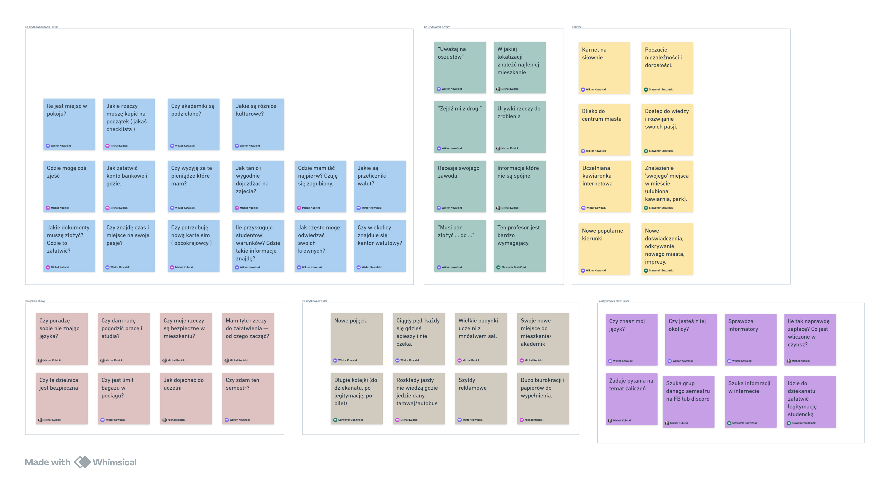
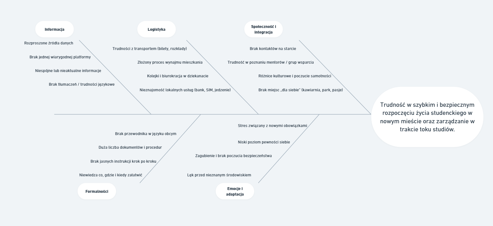
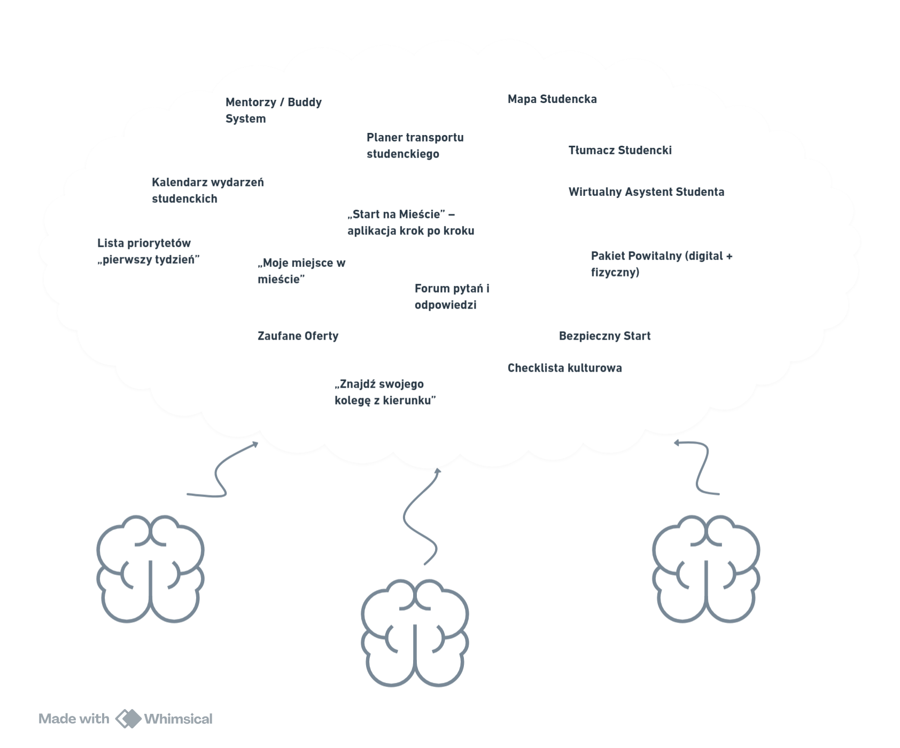
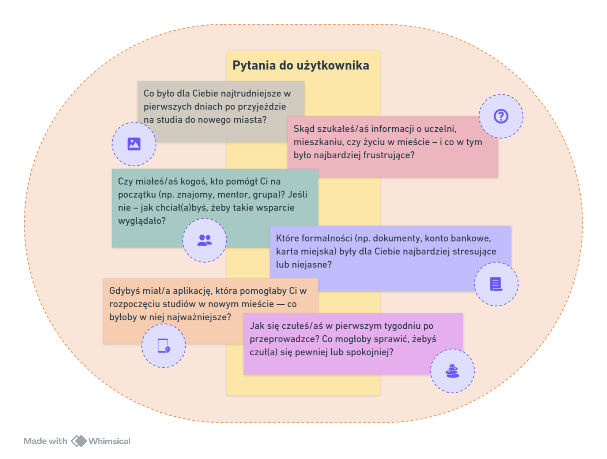

# Projekt Student w mieście

## Nasz zespół:

- Michał Kubicki
- Sławomir Budziński
- Wiktor Kowalski

# 1. Definicja problemu

**Problem główny:**

Nowi studenci (zarówno lokalni, jak i zagraniczni) mają trudności z szybkim i bezpiecznym rozpoczęciem życia studenckiego w nowym mieście – w szczególności z odnalezieniem wiarygodnych informacji, mieszkań, załatwieniem formalności oraz nawiązaniem pierwszych relacji społecznych.

**Objawy problemu:**

- Chaos informacyjny (różne źródła, niespójne dane)
- Brak zaufania do ofert mieszkań lub usług
- Samotność, brak sieci kontaktów
- Bariery językowe i kulturowe
- Stres związany z formalnościami i logistyką (transport, bank, SIM, dokumenty)

**Potrzeba użytkowników:**

> Uproszczony, zaufany, wielojęzyczny przewodnik „na start” – aplikacja wspierająca studenta w pierwszych tygodniach w mieście: krok po kroku, z wiarygodnymi ofertami i wsparciem społeczności. Dodatkowo aplikacja będzie wspierać studenta również później, przez cały okres studiów, dostarczając przydatne informacje, oferty i społecznościowe wsparcie na różnych etapach życia akademickiego.

## Empatyzacja

## Fishbone diagram

## Generowanie Pomysłów

## Prototypowanie

### **Ekran 1: Ekran powitalny / onboarding**

- Logo uczelni lub miasta
- Wybór języka (PL / EN / inne)
- Krótkie pytanie: „Czy jesteś studentem z Polski czy z zagranicy?”

  

### **Ekran 2: Moje pierwsze kroki**

- Checklista z najważniejszymi zadaniami (dynamiczna):

  - Znajdź mieszkanie
  - Zrób legitymację studencką
  - Załóż konto bankowe
  - Kup kartę miejską
  - Poznaj swojego mentora

Każdy element otwiera **mini-przewodnik krok po kroku** (z mapą, linkami i kontaktami).

### **Ekran 3: Mapa Studencka**

**Interaktywna mapa z kategoriami:**

- Zakwaterowanie
- Jedzenie
- Transport
- Miejsca spotkań
- Punkty pomocy uczelnianej

Zawiera tylko **zweryfikowane** miejsca (np. oznaczone przez uczelnię lub społeczność).

### **Ekran 4: Znajdź kolegę / mentora**

- Prosty formularz: wybierz kierunek, rok, język
- Sugestie: „Poznaj Kasię z pierwszego roku informatyki”
- Czat lub wiadomość powitalna („Hej! Szukasz współlokatora?”)

### **Ekran 5: Centrum pomocy**

- Sekcja FAQ: „Jak złożyć dokumenty?”, „Jak dostać się do dziekanatu?”
- Linki do oficjalnych stron uczelni
- Numery alarmowe i kontakt do uczelnianego biura ds. studentów zagranicznych.

## Pytania do użytkownika

